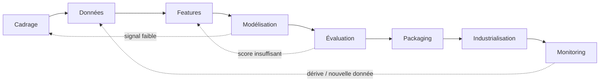

# Référentiel de bonnes pratiques — Projets de Machine Learning & Deep Learning

> Document de référence, réutilisable sur **tout** projet de machine learning ou deep learning.
> Il généralise un cycle complet (cadrage → données → modélisation → évaluation → packaging → industrialisation)
> et rassemble les **choix à faire**, les **métriques**, les **pertes**, les **modèles par spécialité**, la
> **structure de dossier** et les **bonnes pratiques** anti-pièges.
> Les exemples génériques sont parfois illustrés par deux cas fil rouge : *maintenance prédictive* (tabulaire) et
> *détection d'anomalies* (vision).

## Sommaire

1. [Le cycle de vie](#1-le-cycle-de-vie-dun-projet)
2. [Cadrage : les choix de départ](#2-cadrage--les-choix-de-départ)
3. [Données : ingestion & qualité](#3-données--ingestion--qualité)
4. [Choisir le bon découpage (split & CV)](#4-choisir-le-bon-découpage-split--cv)
5. [Les modèles par spécialité](#5-les-modèles-par-spécialité)
6. [Les métriques par type de projet](#6-les-métriques-par-type-de-projet)
7. [Les fonctions de perte (loss)](#7-les-fonctions-de-perte-loss)
8. [Entraînement & optimisation](#8-entraînement--optimisation)
9. [Validation & décision](#9-validation--décision)
10. [Explicabilité](#10-explicabilité)
11. [Packaging & documentation](#11-packaging--documentation)
12. [Industrialisation & monitoring](#12-industrialisation--monitoring)
13. [Structure de dossier d'un projet ML](#13-structure-de-dossier-dun-projet-ml)
14. [Checklist transverse (anti-pièges)](#14-checklist-transverse-anti-pièges)
15. [Annexe — snippets clés](#15-annexe--snippets-clés)

---

## 1. Le cycle de vie d'un projet



Le projet n'est **pas linéaire** : chaque phase peut renvoyer à une précédente. À chaque transition, une **porte
GO / NO-GO** : on ne continue que si la phase précédente est validée.

| Phase | Question clé | Sortie | Porte GO/NO-GO |
|---|---|---|---|
| Cadrage | Quel problème, quelle métrique de succès ? | objectif + métrique cible | besoin clair et mesurable |
| Données | A-t-on des données fiables et représentatives ? | dataset versionné | qualité + volume suffisants |
| Features | Quelles variables, sans fuite ? | features documentées | **aucune fuite de données** |
| Modélisation | Baseline puis modèles candidats | candidats + scores | baseline battue |
| Évaluation | Performance réelle + seuil ? | rapport de validation | métrique cible atteinte |
| Packaging | Modèle livrable et documenté ? | artefacts + model card | reproductible par un tiers |
| Industrialisation | Déployable et supervisable ? | service + monitoring | SLA + alertes en place |
| Monitoring | Le modèle tient-il dans le temps ? | métriques en continu | pas de dérive non gérée |

> **Règle d'or** : *baseline d'abord*. Un modèle simple bien évalué est le mètre-étalon de tout ce qui suit.

---

## 2. Cadrage : les choix de départ

Avant toute ligne de code, trancher :

- **Type d'apprentissage** : supervisé (labels), non supervisé (structure), auto-supervisé, par renforcement.
- **Type de tâche** : classification, régression, ranking, clustering, détection d'anomalies, génération, prévision temporelle.
- **Métrique de succès alignée métier** : ce qu'on optimise doit *coller au coût réel d'une erreur* (voir §6).
- **Contraintes** : latence, coût d'inférence, interprétabilité exigée, budget carbone, données disponibles, RGPD/secteur.
- **Coût asymétrique des erreurs** : un faux négatif coûte-t-il plus qu'un faux positif ? (pilote le seuil, §9).

> 🔧 *Clin d'œil maintenance* : « prédire une panne 24 h à l'avance » → classification binaire déséquilibrée, FN (panne ratée) ≫ FP (maintenance inutile).
> 🔧 *Clin d'œil vision* : « repérer une pièce défectueuse sans défauts annotés » → détection d'anomalies non supervisée.

---

## 3. Données : ingestion & qualité

### Architecture en couches (medallion)

| Couche | Contenu | Règle |
|---|---|---|
| **Bronze** | données brutes, immuables | on ne modifie jamais la source |
| **Silver** | nettoyé, typé, dédupliqué, conforme | qualité validée par des contrôles |
| **Gold** | prêt pour le ML (features + labels) | c'est ce que lit le modèle |

### La fuite de données (*data leakage*) — l'erreur n°1

Une fuite = une information **indisponible au moment de la prédiction** se retrouve dans les features. Symptôme :
des scores trop beaux en validation, qui s'effondrent en production.

Checklist anti-fuite :
- Aucune feature ne dépend d'un événement **postérieur** à l'instant de prédiction.
- Les agrégats glissants sont calculés **uniquement sur le passé**.
- Normalisation / imputation **apprises sur le train seul**, appliquées au reste (via un `Pipeline`).
- Pas de duplication d'un même individu entre train et test (sinon `GroupKFold`).
- Une feature qui « explique tout » est suspecte → vérifier (§10).

### Déséquilibre des classes

Stratégies : **pondération** (`class_weight`, `scale_pos_weight`), rééchantillonnage (SMOTE, under/over-sampling —
**après** le split, jamais avant), métriques adaptées (§6), seuil ajusté (§9). On ne corrige pas un déséquilibre
avec l'accuracy.

### RGPD & protection des données personnelles

Dès qu'un projet manipule des **données personnelles** (identifiants, clients, RH, santé…), le RGPD s'applique et
encadre **tout** le cycle de vie — pas seulement le stockage. Points à intégrer dès le cadrage :

- **Base légale & finalité** : un traitement n'est licite que pour une finalité **définie et légitime**, sur une base valable (consentement, intérêt légitime, obligation légale…). On ne réutilise pas des données pour un autre usage sans le justifier.
- **Minimisation** : ne collecter et n'entraîner que sur les variables **réellement nécessaires** — une feature personnelle non indispensable est un risque, pas un atout.
- **Pseudonymisation / anonymisation** : retirer ou hacher les identifiants directs ; attention, une **vraie** anonymisation est difficile (risque de ré-identification par croisement). Pseudonymisé reste une donnée personnelle.
- **Durée de conservation** limitée + **sécurité** (chiffrement, accès restreints, traçabilité).
- **Droits des personnes** : accès, rectification, **effacement**, opposition. Le droit à l'effacement peut entrer en tension avec un modèle déjà **entraîné** sur ces données — à anticiper (procédure de ré-entraînement / suppression).
- **AIPD (DPIA)** : une **analyse d'impact** est obligatoire pour les traitements à risque élevé (profilage à grande échelle, données sensibles, décision automatisée).
- **Décision automatisée (art. 22)** : une personne a le droit de **ne pas** subir une décision entièrement automatisée à effet significatif → garder un **humain dans la boucle** et savoir **expliquer** (lien direct avec §10, explicabilité).
- **Articulation avec l'AI Act** : le RGPD protège les **données personnelles**, l'AI Act encadre le **risque du système d'IA** ; les deux **se cumulent**.

Réflexe projet : impliquer le **DPO** tôt, tenir un **registre des traitements**, et privilégier des données **agrégées,
anonymisées ou synthétiques** quand c'est possible.

> 🔧 *Clin d'œil* : des données capteurs de maintenance sont en général **non personnelles** — mais si elles sont reliées à un **opérateur identifiable** (badge, planning), elles le redeviennent. Le contexte médical (imagerie, dossiers) relève, lui, de **données de santé sensibles**, à protection renforcée.

---

## 4. Choisir le bon découpage (split & CV)

Le découpage dépend de la **structure** des données — s'y tromper crée une fuite.

| Situation | Découpage | Pourquoi |
|---|---|---|
| Données i.i.d. classiques | `train_test_split`, `KFold` | hypothèse d'indépendance |
| Classes déséquilibrées | `StratifiedKFold` | préserve les proportions |
| **Données temporelles** | `TimeSeriesSplit` (train < val < test) | interdit de « voir le futur » |
| Individus répétés (patients, machines) | `GroupKFold` | aucun groupe à cheval train/test |

Règles universelles :
- **3 jeux** : train (apprendre) / validation (régler, choisir le seuil) / test (juger **une seule fois**).
- Le **test reste intouché** jusqu'à la validation finale.
- Le seuil et les hyperparamètres se choisissent sur la **validation**, jamais sur le test.

> 🔧 *Maintenance* : strictement temporel (les capteurs sont une série). 🔧 *Vision MVTec* : on n'entraîne que sur les images **saines**, les défauts servent uniquement au test.

---

## 5. Les modèles par spécialité

Principe : **commencer simple**, monter en complexité seulement si le gain le justifie (perf, mais aussi coût et interprétabilité).

### Données tabulaires
| Niveau | Modèles | Quand |
|---|---|---|
| Baseline | régression logistique / linéaire, arbre de décision | référence, interprétable |
| Solide | **Random Forest**, gradient boosting (**XGBoost, LightGBM, CatBoost**) | le standard tabulaire, souvent gagnant |
| Avancé | réseaux tabulaires (TabNet, FT-Transformer) | gros volumes, rarement nécessaire |

### Vision
| Tâche | Modèles |
|---|---|
| Classification | CNN, **transfer learning** (ResNet, EfficientNet, MobileNet), ViT |
| Détection / segmentation | YOLO, Faster R-CNN, U-Net, Mask R-CNN |
| Détection d'anomalies | auto-encodeur (baseline), **PatchCore / PaDiM** (SOTA, features pré-entraînées) |

### Texte / NLP
| Niveau | Modèles |
|---|---|
| Baseline | TF-IDF + linéaire / SVM |
| Standard | embeddings + transformers (**BERT** et variantes) |
| Génératif | LLM (fine-tuning, RAG, prompting) |

### Séries temporelles
ARIMA/SARIMA (statistique), gradient boosting **sur features** (lags, rolling — souvent le plus efficace),
RNN/LSTM/GRU, TCN, Temporal Fusion Transformer.

### Non supervisé
Clustering (**k-means**, DBSCAN, hiérarchique), réduction de dimension (PCA, UMAP, t-SNE),
détection d'anomalies (**Isolation Forest**, One-Class SVM, auto-encodeur).

---

## 6. Les métriques par type de projet

> Distinguer **métrique** (ce qu'on *juge*) et **loss** (ce qu'on *optimise*, §7). Et choisir la métrique **avant** d'entraîner.

### Classification binaire
| Métrique | Lit… | À privilégier quand |
|---|---|---|
| Accuracy | bonnes réponses globales | classes équilibrées (**trompeuse sinon**) |
| Précision | qualité des positifs prédits | les fausses alertes coûtent cher |
| Rappel (sensibilité) | positifs retrouvés | rater un positif coûte cher |
| F1 / Fβ | compromis précision/rappel (β pondère le rappel) | besoin d'un seul chiffre |
| **ROC-AUC** | capacité de classement, seuil-indépendant | classes équilibrées, coûts proches |
| **PR-AUC (AP)** | qualité sur la classe positive | **positifs rares** (fraude, panne, maladie) |
| Log loss / Brier | qualité des **probabilités** | si on utilise la proba, pas juste la classe |
| MCC, balanced accuracy | équilibre toutes classes | déséquilibre |

**ROC-AUC vs PR-AUC** : la ROC a une ligne de base **constante à 0,5** ; la PR-AUC a une ligne de base **égale au
taux de positifs** (1 % de positifs → 0,01). Sur données déséquilibrées, la ROC peut paraître flatteuse alors que
la PR révèle l'échec → **privilégier la PR-AUC**.

### Classification multi-classe
F1 **macro** (traite les classes à égalité) / **micro** (pondère par effectif) / **weighted** ; top-k accuracy ; matrice de confusion.

### Régression
| Métrique | Particularité |
|---|---|
| MAE | erreur moyenne absolue, robuste aux outliers, interprétable |
| MSE / RMSE | pénalise fort les grosses erreurs (RMSE = même unité que la cible) |
| MAPE | erreur en %, attention aux valeurs proches de 0 |
| R² | part de variance expliquée (peut être négatif) |
| Pinball (quantile) | régression de quantiles / intervalles |

### Autres tâches
| Tâche | Métriques |
|---|---|
| Ranking / reco | NDCG, MAP, MRR, recall@k |
| Clustering | silhouette, Davies-Bouldin ; ARI / NMI (si labels connus) |
| Détection d'anomalies | **AUROC**, AUPRC ; seuil calibré sur les normaux |
| Détection objet / segmentation | IoU, **mAP**, Dice |
| NLP génératif | BLEU, ROUGE, perplexité, exact match (+ évals humaines / LLM-judge) |

> **Le seuil n'est pas la métrique** : la plupart des métriques de classification dépendent d'un seuil de décision (souvent ≠ 0,5). Choisir le seuil par le **coût métier** (§9). Si on utilise les probabilités, vérifier la **calibration**.

---

## 7. Les fonctions de perte (loss)

La loss est **dérivable** et guide l'apprentissage ; la métrique, elle, juge le résultat (souvent non dérivable).
On choisit parfois une loss *proxy* de la métrique visée.

| Tâche | Pertes courantes | Note |
|---|---|---|
| Régression | **MSE/L2**, **MAE/L1**, **Huber**, log-cosh, pinball | Huber = compromis MSE/MAE robuste aux outliers ; pinball pour les quantiles |
| Classif binaire | **binary cross-entropy** (log loss), hinge | BCE est le défaut |
| Classif multi-classe | **categorical cross-entropy** | + label smoothing parfois |
| Déséquilibre | **focal loss**, BCE **pondérée** (`class_weight`) | focal abaisse le poids des exemples faciles |
| Vision (segmentation) | **Dice loss**, IoU loss, BCE | Dice gère le déséquilibre pixel |
| Reconstruction / anomalie | **MSE**, **SSIM**, perceptual | SSIM plus sensible à la structure/texture |
| Ranking | pairwise (RankNet), listwise (LambdaRank) | |
| Embeddings / métrique | triplet loss, contrastive, InfoNCE | apprentissage de représentations |

> Relation loss ↔ métrique : optimiser la BCE améliore *en général* l'AUC, mais pas toujours le **rappel au seuil métier**. D'où l'étape de **choix de seuil** séparée.

---

## 8. Entraînement & optimisation

### Démarche
1. **Baseline** simple, métrique de référence **figée**.
2. Feature engineering et modèle candidat.
3. **Tuning raisonné** des hyperparamètres.
4. **Régularisation** (L1/L2, dropout, profondeur, `min_child_weight`…) et **early stopping**.
5. Gestion du déséquilibre (`class_weight` / `scale_pos_weight`).

### Recherche d'hyperparamètres
| Stratégie | Principe | Coût | Limite |
|---|---|---|---|
| **GridSearchCV** | teste toutes les combinaisons d'une grille | explose en N dimensions | points discrets, aveugle |
| **RandomizedSearchCV** | tirage aléatoire dans des distributions | budget fixé (`n_iter`) | n'apprend pas des essais |
| **Optuna (TPE)** | apprend des essais → cible les zones prometteuses | budget borné + **pruning** | stochastique |

*Image* : la grille inspecte chaque case de l'échiquier ; Optuna joue à la chasse au trésor (plus chaud / plus froid).

### Bonnes pratiques transverses
- **Reproductibilité** : graine fixée, versions des libs, données versionnées.
- **Suivi d'expériences** : MLflow (params, métriques, artefacts).
- **Éco-conception** : mesurer (CodeCarbon) et raisonner en **coût par point gagné** ; la parcimonie est souvent la bonne décision.

---

## 9. Validation & décision

Transformer un score en **décision fiable** :

- **Courbes** : ROC et **PR** (PR prioritaire si déséquilibre).
- **Seuil** : balayer les seuils, retenir celui qui **minimise le coût métier** (FN vs FP), **sur la validation**.
- **Calibration** : une probabilité doit « vouloir dire quelque chose » (reliability diagram, score de Brier) ; recalibrer si besoin (isotonic, Platt).
- **Zones grises** : double seuil → *sain / à inspecter / anomalie* ; les cas incertains partent en revue humaine (utile à signal faible).
- **Matrice de confusion** au seuil retenu : sensibilité, spécificité, précision.
- **Robustesse** : CV répétée / nested CV pour estimer la **variance** du score (deux modèles à scores qui se chevauchent ne sont pas différents).
- **Non-régression** : des tests qui échouent si la métrique repasse sous une référence.

---

## 10. Explicabilité

| Outil | Portée | Usage |
|---|---|---|
| Importance par permutation | globale | quelles features comptent, modèle-agnostique |
| **SHAP** | globale **et** locale | contribution de chaque feature à une prédiction |
| PDP / ICE | globale | effet marginal d'une feature |
| Attention / Grad-CAM | locale | NLP / vision (où le modèle « regarde ») |

Principes : **importance ≠ causalité** ; une feature qui domine tout doit faire **suspecter une fuite** ;
l'explicabilité sert autant à **debugger** qu'à **rendre des comptes** (auditeur, client).

---

## 11. Packaging & documentation

Un modèle qui *marche* n'est pas un modèle *livrable*. Le paquet doit permettre à un tiers de **rejouer** le modèle.

Artefacts à figer : **pipeline complet** (preprocessing + modèle) sérialisé, **schéma d'entrée/sortie**, **seuil**
retenu, **métriques de référence**, **environnement gelé**, **version** (hash), **snapshot de données**.

- **Contrat I/O** (ex. JSON) : entrée validée, sortie structurée (score, décision, version), erreurs explicites.
- **Model card** : objectif, usages (direct / aval / **hors-périmètre**), données, métriques, **limites & risques**,
  impact environnemental, version. Suivre le [template Hugging Face](https://github.com/huggingface/huggingface_hub/blob/main/src/huggingface_hub/templates/modelcard_template.md).
- **Test de re-chargement** : recharger les artefacts → reproduire une prédiction de référence.

---

## 12. Industrialisation & monitoring

- **Déploiement** : API exposant le contrat I/O, conteneurisation, environnement cible reproductible.
- **Monitoring** : métriques techniques (latence, erreurs) **et** métier (rappel, alertes).
- **Dérive** : *data drift* (les entrées changent) et *concept drift* (la relation X→y change) ; surveiller via PSI / tests de distribution.
- **Ré-entraînement** : protocole périodique (fréquence, jeu de contrôle, seuils d'alerte, qui est prévenu).
- **MLOps** : CI/CD avec tests de non-régression, **model registry** (versions, promotion, rollback).
- **Éthique & conformité** : usage encadré (aide à la décision, pas d'automatisation aveugle), transparence, documentation (AI Act).

---

## 13. Structure de dossier d'un projet ML

```
mon-projet-ml/
├── README.md                  # objectif, installation, usage
├── pyproject.toml             # dépendances + version (uv / poetry / pip)
├── .gitignore                 # ignore data/, models/, .env, mlruns/
├── .env.example               # secrets attendus (jamais le vrai .env)
├── Makefile                   # commandes reproductibles (make train, make test)
├── config/
│   └── config.yaml            # chemins, hyperparamètres (config-driven, pas de magie en dur)
├── data/                      # JAMAIS commité (versionné via DVC ou stocké en cloud)
│   ├── raw/                   # bronze : brut, immuable
│   ├── interim/               # silver : nettoyé
│   └── processed/             # gold : prêt ML (features + labels)
├── notebooks/                 # exploration, numérotés et jetables
│   └── 01_eda.ipynb
├── src/<package>/             # code source réutilisable et testable
│   ├── data/                  # chargement, split, validation de schéma
│   ├── features/              # feature engineering
│   ├── models/                # train.py, predict.py, tune.py
│   ├── evaluation/            # métriques, calibration, rapports
│   └── utils/
├── models/                    # artefacts sérialisés (via DVC / registry)
├── tests/                     # pytest, dont tests de non-régression métrique
├── reports/
│   ├── figures/               # courbes, SHAP, matrices de confusion
│   └── model_card.md
└── mlruns/                    # suivi d'expériences MLflow (ignoré par git)
```

Bonnes pratiques de structure :
- **Séparer le code (`src/`) des notebooks** : les notebooks explorent, `src/` est la source de vérité testée.
- **Ne jamais committer données ni secrets** ; versionner les données avec DVC, les modèles via un registry.
- **Config-driven** : chemins et hyperparamètres dans `config/`, pas codés en dur.
- **Environnement reproductible** : lockfile (`uv.lock`, `poetry.lock`).
- **Tests** : au minimum la non-régression métrique et un test de re-chargement du modèle.
- **Pipeline** : encapsuler preprocessing + modèle dans un seul objet sérialisable.

---

## 14. Checklist transverse (anti-pièges)

- [ ] Métrique de succès définie **avant** d'entraîner, alignée sur le coût métier.
- [ ] Découpage adapté (temporel / groupes / stratifié) — **test intouché**.
- [ ] **Aucune fuite** : features ne regardent pas le futur ; preprocessing appris sur le train seul.
- [ ] Baseline simple battue avant de complexifier.
- [ ] Déséquilibre traité (pondération + métrique PR + seuil), pas masqué par l'accuracy.
- [ ] Seuil choisi sur la validation, par le coût ; probabilités calibrées si on les utilise.
- [ ] Variance du score estimée (le gain est-il réel ?).
- [ ] Coût (temps, CO₂) comparé au gain de performance.
- [ ] Explicabilité vérifiée (et pas de feature « trop belle » = fuite).
- [ ] Modèle packagé, versionné, documenté (model card), rejouable.
- [ ] Monitoring + dérive + protocole de ré-entraînement prévus.

---

## 15. Annexe — snippets clés

**Découpage temporel + CV adaptée**
```python
from sklearn.model_selection import TimeSeriesSplit, StratifiedKFold, GroupKFold
cv = TimeSeriesSplit(n_splits=5)            # séries temporelles
# cv = StratifiedKFold(5, shuffle=True)     # i.i.d. déséquilibré
# cv = GroupKFold(5)                        # individus répétés (split sur groups=...)
```

**Métrique adaptée au déséquilibre + pondération**
```python
from sklearn.metrics import average_precision_score   # PR-AUC
# scorer intégré pour la recherche d'hyperparamètres : scoring="average_precision"
# pondération : XGBClassifier(scale_pos_weight=neg/pos)  ou  class_weight="balanced"
```

**Objectif Optuna (recherche guidée)**
```python
import optuna, numpy as np
def objective(trial):
    params = dict(
        max_depth=trial.suggest_int("max_depth", 3, 8),
        learning_rate=trial.suggest_float("lr", 1e-2, 3e-1, log=True),
    )
    scores = [score_fold(params, tr, va) for tr, va in cv.split(X)]
    return float(np.mean(scores))

study = optuna.create_study(
    direction="maximize",
    sampler=optuna.samplers.TPESampler(seed=42),
    pruner=optuna.pruners.MedianPruner(),
)
study.optimize(objective, n_trials=40, timeout=1800)   # budget borné
```

**Choix du seuil par le coût (sur la validation)**
```python
import numpy as np
COUT_FN, COUT_FP = 10, 1            # une panne ratée coûte 10x une fausse alerte
seuils = np.linspace(0.01, 0.99, 99)
def cout(s):
    pred = (proba_val >= s).astype(int)
    fn = ((pred == 0) & (y_val == 1)).sum()
    fp = ((pred == 1) & (y_val == 0)).sum()
    return COUT_FN * fn + COUT_FP * fp
seuil = min(seuils, key=cout)
```

**Calibration des probabilités**
```python
from sklearn.calibration import CalibratedClassifierCV
calibre = CalibratedClassifierCV(modele, method="isotonic", cv="prefit")
calibre.fit(X_val, y_val)           # sur un jeu dédié, jamais le train
```

**Explicabilité SHAP (arbres)**
```python
import shap
explainer = shap.TreeExplainer(modele)
sv = explainer(X_sample)
shap.plots.beeswarm(sv)             # global
shap.plots.waterfall(sv[0])         # local (une prédiction)
```

**Sérialiser le pipeline complet (preprocessing + modèle)**
```python
import joblib
joblib.dump(pipeline, "models/pipeline.joblib")   # PAS seulement le modèle
# rechargement → reproduire une prédiction de référence (test d'autonomie du paquet)
```

---

*Ce référentiel est volontairement généraliste : adaptez les seuils, métriques et modèles à votre domaine. Le fil
conducteur reste constant — un choix explicite à chaque étape, une évaluation honnête, et un paquet rejouable.*
